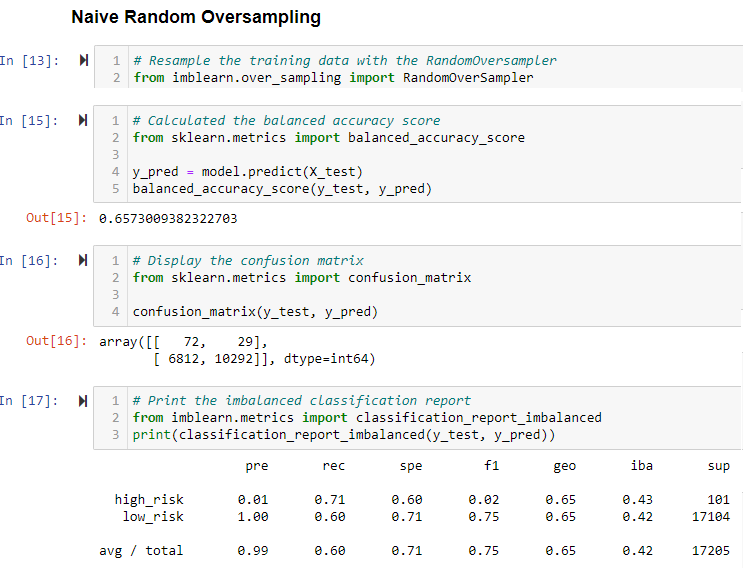
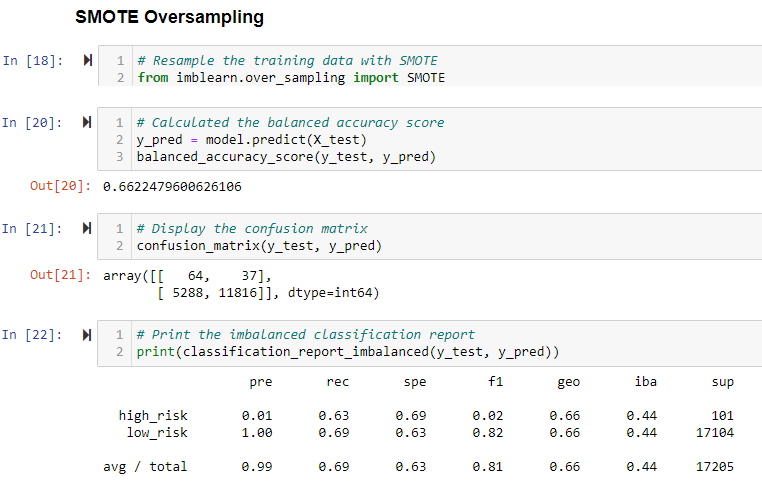
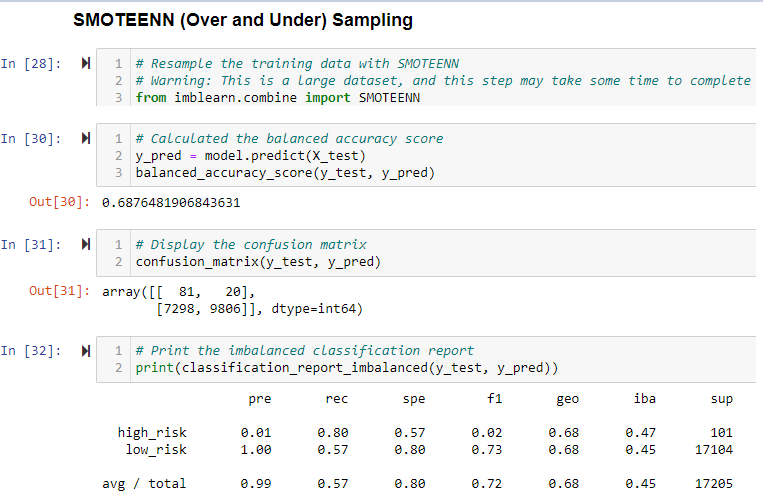
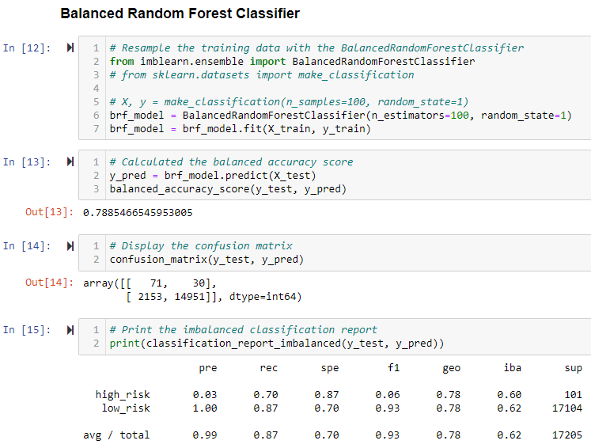
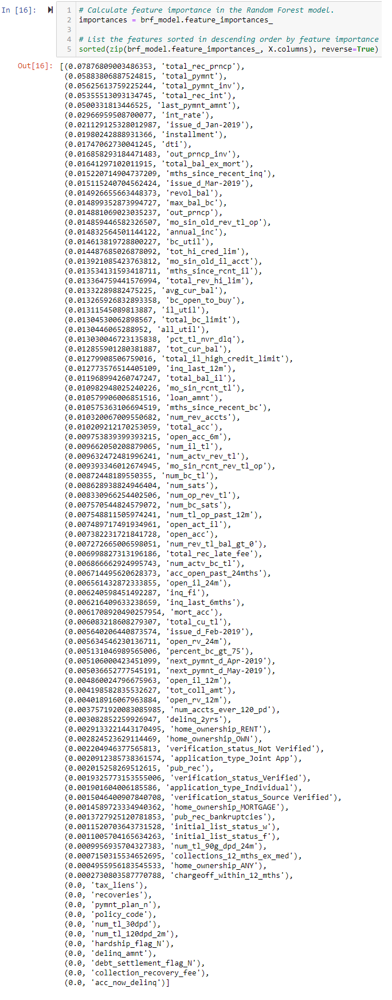
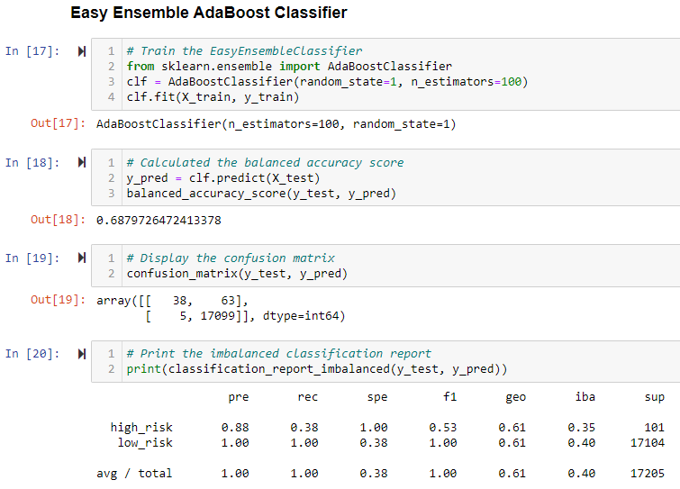

# Credit_Risk_Analysis
Supervised Machine Learning

## Overview of the loan prediction risk analysis:
The purpose of this analysis is well defined

## Results:
### Deliverable 1: Use Resampling Models to Predict Credit Risk
Using your knowledge of the imbalanced-learn and scikit-learn libraries, you’ll evaluate three machine learning models by using resampling to determine which is better at predicting credit risk. First, you’ll use the oversampling RandomOverSampler and SMOTE algorithms, and then you’ll use the undersampling ClusterCentroids algorithm. Using these algorithms, you’ll resample the dataset, view the count of the target classes, train a logistic regression classifier, calculate the balanced accuracy score, generate a confusion matrix, and generate a classification report.

- Naive Random Oversampling:
    - 
- SMOTE Oversampling
    - 
- ClusterCentroids Undersampling
    - 

### Deliverable 2: Use the SMOTEENN algorithm to Predict Credit Risk
Using your knowledge of the imbalanced-learn and scikit-learn libraries, you’ll use a combinatorial approach of over- and undersampling with the SMOTEENN algorithm to determine if the results from the combinatorial approach are better at predicting credit risk than the resampling algorithms from Deliverable 1. Using the SMOTEENN algorithm, you’ll resample the dataset, view the count of the target classes, train a logistic regression classifier, calculate the balanced accuracy score, generate a confusion matrix, and generate a classification report.
- SMOTEEN Over/Under Sampling
    - 

### Deliverable 3: Use Ensemble Classifiers to Predict Credit Risk
Using your knowledge of the imblearn.ensemble library, you’ll train and compare two different ensemble classifiers, BalancedRandomForestClassifier and EasyEnsembleClassifier, to predict credit risk and evaluate each model. Using both algorithms, you’ll resample the dataset, view the count of the target classes, train the ensemble classifier, calculate the balanced accuracy score, generate a confusion matrix, and generate a classification report.
- Balanced Random Forest Classifier
    - 
- Balanced Random Forest Feature Importance
    - 
- Easy Ensemble AdaBoost Classifier
    - 

## Summary: 
Summarize the results of the machine learning models

include a recommendation on the model to use, if any. If you do not recommend any of the models, justify your reasoning.