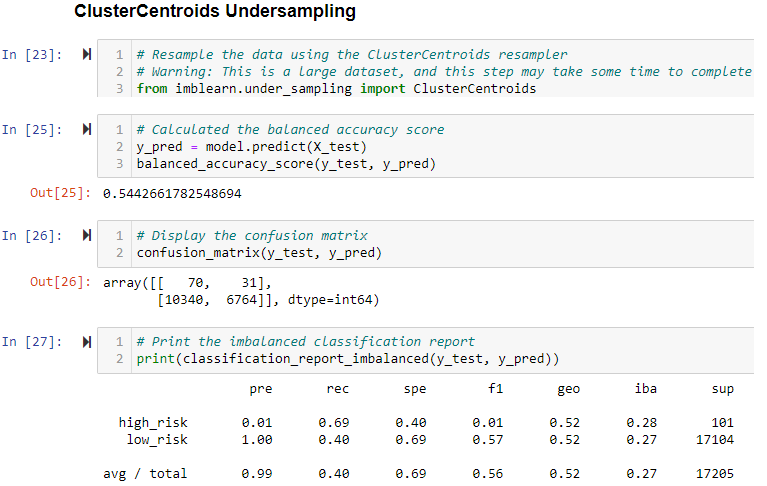

# Credit_Risk_Analysis - Supervised Machine Learning

## Overview of the loan prediction risk analysis:
The purpose of this analysis is to apply machine learning to solve a real-world challenge: credit card risk.

Classifying credit risk is an unbalanced problem since good loans easily outnumber risky loans, therefore, multiple different techniques to train and evaluate models will be used to determine which model is best to use for this dataset and goal.  This analysis will use imbalanced-learn and scikit-learn libraries to build and evaluate models using resampling.

Using the credit card credit dataset from LendingClub, a peer-to-peer lending services company, the first analysis will be to oversample the data using the RandomOverSampler and SMOTE algorithms, and then under sample the data using the ClusterCentroids algorithm. Next the combinatorial approach of over- and under sampling using the SMOTEENN algorithm will be used. Next, two new machine learning models that reduce bias will be compared: BalancedRandomForestClassifier and EasyEnsembleClassifier to predict credit risk. With the results from each model, the performance of these models will be evaluated and a written recommendation will be made on whether they should be used to predict credit risk.

## Results:
### Deliverable 1: Use Resampling Models to Predict Credit Risk
Using the imbalanced-learn and scikit-learn libraries, evaluate three machine learning models by using resampling to determine which is better at predicting credit risk. The methods utilized for oversampling will be RandomOverSampler and SMOTE algorithms, and then the under sampling ClusterCentroids algorithm will be used. With these algorithms, the dataset is resampled, the count of the target classes are used to train a logistic regression classifier, calculate the balanced accuracy score, generate a confusion matrix, and generate a classification report.  The results are as follows:

- Naive Random Oversampling:

- SMOTE Oversampling

- ClusterCentroids Undersampling

### Deliverable 2: Use the SMOTEENN algorithm to Predict Credit Risk
Using the imbalanced-learn and scikit-learn libraries, a combinatorial approach of over- and under sampling with the SMOTEENN algorithm will determine if the results from the combinatorial approach are better at predicting credit risk than the resampling algorithms from Deliverable 1. Using the SMOTEENN algorithm, resample the dataset, view the count of the target classes, train a logistic regression classifier, calculate the balanced accuracy score, generate a confusion matrix, and generate a classification report.  The results are as follows:
- SMOTEEN Over/Under Sampling

### Deliverable 3: Use Ensemble Classifiers to Predict Credit Risk
Using the imblearn.ensemble library, train and compare two different ensemble classifiers, BalancedRandomForestClassifier and EasyEnsembleClassifier, to predict credit risk and evaluate each model. Using both algorithms, resample the dataset, view the count of the target classes, train the ensemble classifier, calculate the balanced accuracy score, generate a confusion matrix, and generate a classification report.  The results are as follows:
- Balanced Random Forest Classifier

- Balanced Random Forest Feature Importance

- Easy Ensemble AdaBoost Classifier

## Summary: 
All the models were able to handle the unbalanced data, however, some are better suited to provide better results compared to others.  Given that this model is providing a yes/no decision to decide if a financial institution is going to lend their money, it is critical to have a high confidence in the model with a low number of false positives.  This will ensure that loan applicants that are actually high risk don't get classified as low risk.  With this reasoning, it is important to choose a model with a high recall value as this value directly correlates to the number of false negatives, a very important number when there is a high cost associated with a False Negative.  

For this analysis the recommended model to utilize would be the Easy Ensemble AdaBoost Classifier as this had only 5 high risk cases misclassified.  It would be better to require more investigation into borderline cases, then giving loans out to actually high risk individuals who are thought to be low risk.  The second best model would be the Balanced Random Forest Classifier as this had the second highest recall value overall.